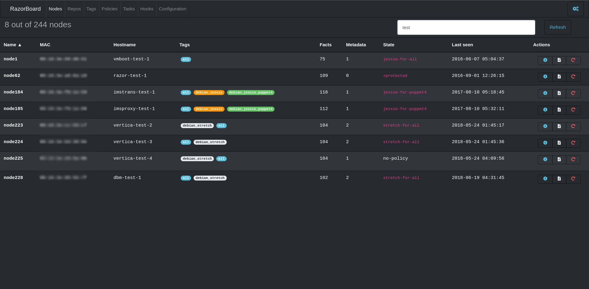
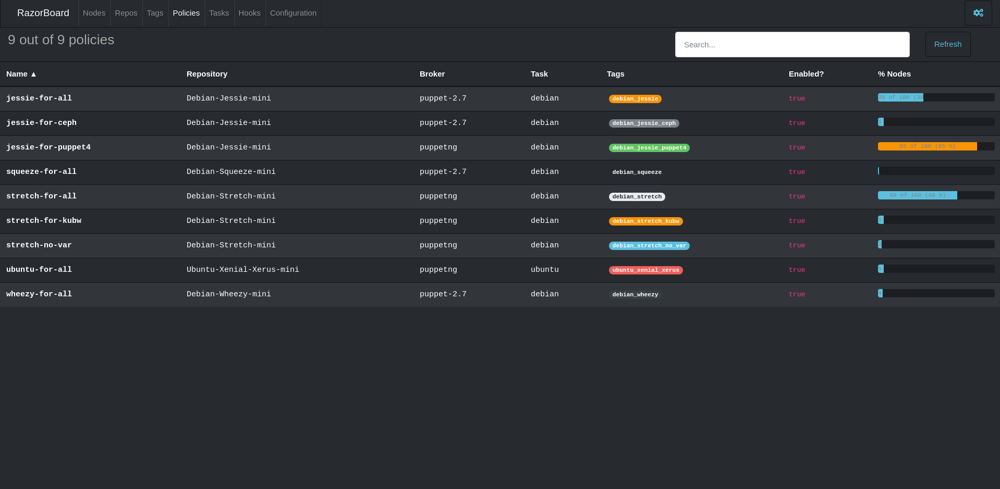
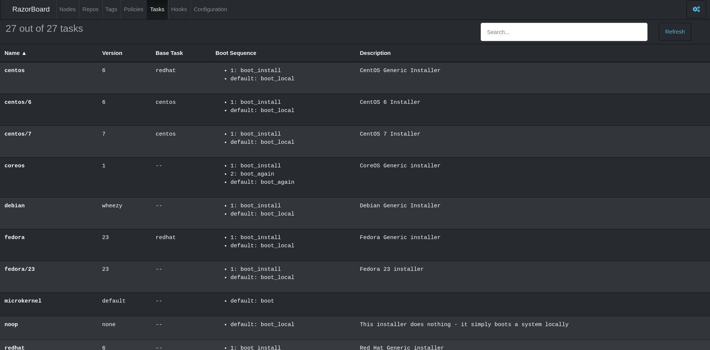

# Razorboard

> Visualize and manage resources in a [Razor server](https://github.com/puppetlabs/razor-server)

## Why this project?

While razor CLI is enough to manage a razor server, it requires some knowledge about what razor is and
how it works. Using razor CLI you'll sooner or later find some of the following problems when you want
to query or reprovision a node:
- Find a node ID when you only know its MAC address. This is "easiest" as `razor nodes` reports the node MAC in the same row of its ID
 so `razor nodes | grep 00:00:00:00:00` is OK.
- Find a node ID when you only know its current hostname. This is hardest, as you'll need a very well crafted `curl` to your razor
 API `api/collections/nodes?depth=1` endpoint and some `jq` black magic.
- Following razor logs when a node is being provisioned. For those that don't fully trust `preseed`, `kickstart` or any other provisioning
 method, `watch razor nodes nodeID logs` has been used to track provisioning process.

So **Razorboard** was created, to simplify previous (and probably other) tasks making Razor API available under a Web UI
that lets you visualize, query and manage razor server without having to know all `razor` CLI subcommands.

### Screenshots

**Nodes list**


**Policies list**


**Tasks list**


### Developing 🔧

A full working developing environment is included using `docker-compose`. To start it, you can just execute

```
docker-compose up
```

This will start the following containers:

- **razorserver**: A working Razor server listening at port 8150.
- **postgres**: Internal Razor database listening at port 5432.
  - If you have a Razor database dump, you can place it under `dev-environment/postgres` folder with `.sql` extension,
   postgres container will load the dump at boot time.
- **razorboard**: Razorboard started using `ng serve`, with live-reload support and rest of AngularJS develepment niceties,
 listening at port 4200.

## Testing ⚙️


## Deployment 📦

A Dockerfile is provided for building the project. It builds angular application and serves
static files with nginx. Additionally a *reverse proxy* is configured in nginx to redirect Razor
API requests sent to the same Razorboard host.

For building docker image just run `docker build .`

For running Razorboard using docker you can:

```
docker run -it --rm -e RAZOR_API=http://my-razor-host:8150 -p8080:80 razorboard:v0.1.0
```

This will serve Razorboard at port **8080** and also proxy Razor API requests to `http://my-razor-host:8150`.

### NOTE

Securing both Razor API is outside of the scope of this project, for additional information about how to
secure Razor API read [here](https://github.com/puppetlabs/razor-server/wiki/Securing-the-server).

## TODO LIST

* [X] Visualize all Razor API resources
* [X] reinstall-node command
* [ ] HTTPS nginx configuration at Dockerfile
* [ ] Support Razor API basic authentication
* [X] Node metadata modification

## Built with 🛠️

* [AngularJS](https://angularjs.org/) - Version 8.2.1

## Versioning 📌

[SemVer](http://semver.org/) is followed to create versions.
For a list of versions and what changed you can check [changelog](./CHANGELOG.md)

## License 📄

TBD
